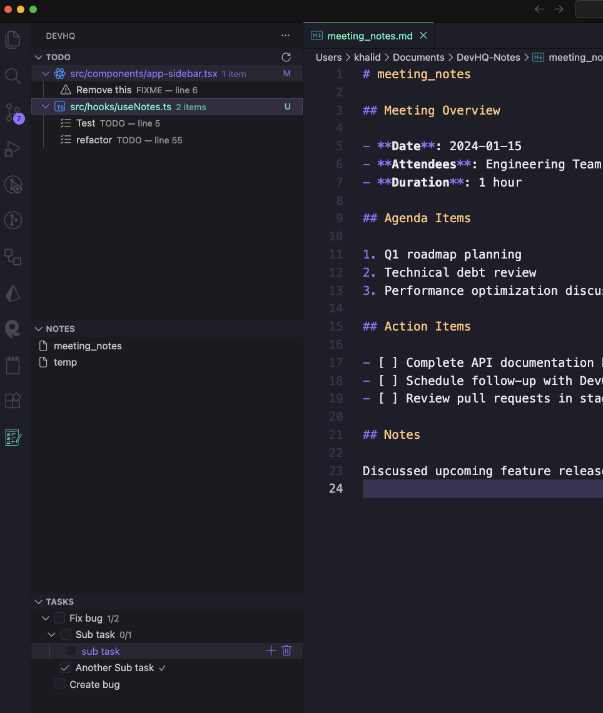

# DevHQ


A developer-focused VS Code extension that brings together **tasks**, **notes**, and a **TODO/FIXME code tree** — all in one clean workspace panel.

DevHQ helps you stay organized without leaving your editor.



---

## ✨ Features

### 🗂️ Unified Dev Panel

A single panel that contains three tabs:

#### ✔️ **1. Checklist (Tasks)**

- Add / remove / check off tasks
- Persistent storage across sessions
- Keyboard-friendly

#### 📝 **2. Notes**

- Quick notes area for ideas, snippets, reminders
- Markdown-friendly text area (optional future mode)

#### 🌲 **3. TODO/FIXME Tree**

- Automatically scans your project for:
  - `TODO`
  - `FIXME`
- Organised by file
- Click to jump directly to source

---

## 🚀 Getting Started (Development)

### 1. Install dependencies

### 2. Run watch

```
npm run watch
```

### 3. Run the extension in VS Code

Press **F5** to launch the VS Code Extension Host.

---

## 🧩 Commands

| Command                  | Description                       |
| ------------------------ | --------------------------------- |
| **DevHQ: Refresh Task**  | Refresh tasks list                |
| **DevHQ: Refresh Notes** | Refresh notes list                |
| **DevHQ: Refresh Todos** | Rescan code and refresh todo list |
| **DevHQ: New Task**      | Create new task                   |
| **DevHQ: New Note**      | Create new note                   |
| **DevHQ: Clear Notes**   | Clears all notes                  |

---

---

## 🛠 Tech Stack

- **TreeDataProvider**
- **TypeScript**

---

## 🤝 Contributing

PRs, issues, and suggestions are welcome!  
This project is meant to grow into a polished dev productivity tool.

---

## 📜 License

MIT License.
